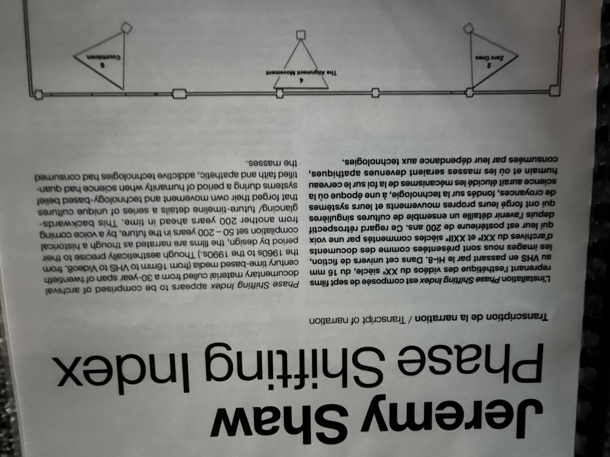

# JEREYMY SHAW phase shifting index

## Fonderie Darling

## exposition intérieur

## date de la sortie: 31 Janvier 2024

## L'auteur: Jeremy Shaw

## Réaliser en 2020

## Description
Phase Shifting Index (2020) décrit sept groupes autonomes engagés dans des systèmes de croyance incarnés et basés sur le mouvement qui aspirent à induire des réalités parallèles. Utilisant divers médias démodés du XXe siècle, allant du film 16 mm à la bande vidéo Hi-8, Shaw présente ce qui semble être des séquences documentaires comme un futur lointain, créant une dissonance cognitive dans la relation du spectateur avec un sentiment de lieu et de temps.

## Installation Immersive

## Mise en place

Il ya 7 vidéos différentes qui jouent en même temps.

